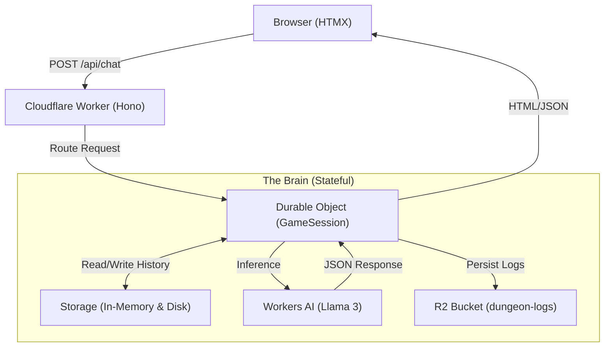

# ⚔️ Cloudflare AI Dungeon Master

**A serverless, stateful, text-based RPG engine built entirely on the Cloudflare Developer Platform.**

This project demonstrates how to build a complex, stateful application on the Edge using **Cloudflare Workers**, **Durable Objects**, **Workers AI**, and **R2**. It is not just a wrapper around an LLM; it is a full-stack game engine that maintains persistent state, handles structured data, and logs gameplay for analytics.

🔗 **[Live Demo](https://cf_ai_dungeon_master.oieralduntzin.workers.dev)**

---

## 🏗️ Architecture

This application moves beyond stateless HTTP requests by utilizing **Durable Objects** to maintain a persistent "Game Brain" for each user session.



### 📂 Project Structure

The codebase follows a modular architecture designed for scalability and separation of concerns:

```text
cf_ai_dungeon_master/
├── src/
│   ├── ai/
│   │   └── prompts.ts       # System prompts
│   ├── components/
│   │   └── template.html    # HTML/HTMX UI Template
│   ├── objects/
│   │   └── GameSession.ts   # The Durable Object
│   ├── routes/
│   │   └── game.ts          # API Route definitions
│   ├── utils/
│   │   └── logger.ts        # R2 Cloud Logging Utility
│   ├── index.ts             # Application Entry Point
│   └── types.ts             # TypeScript Interfaces
├── wrangler.toml            # Infrastructure-as-Code Config
└── README.md                # Documentation

```

### Key Technical Components

* **Runtime:** **Cloudflare Workers** (TypeScript) for low-latency edge execution.

* **State Management:** **Durable Objects** provide strong consistency. Each player's session is a unique "actor" that persists state (History, HP, Context) across requests.

* **AI Inference:** **Workers AI** running `@cf/meta/llama-3-8b-instruct`. The system prompt enforces a strict JSON schema to turn natural language into structured game data.

* **Frontend:** **HTMX** for a "No-Build" reactive UI. Features **Optimistic UI** updates for zero-latency user feedback while the AI processes.

* **Logging:** **Cloudflare R2** acts as a data lake, storing structured JSON logs of every interaction and crash report for debugging and analytics.

---

## 🚀 Features

* **🧠 Persistent Memory:** The AI remembers the entire context of the adventure via Durable Object storage.

* **⚡ Optimistic UI:** The interface updates instantly using client-side event interception, ensuring a smooth UX even during heavy AI inference loads.

* **❤️ Real-time Stats:** The backend parses the AI's output to extract structured data (Health Points), dynamically updating the UI health bar.

* **🛡️ Security:** Implemented application-level **Rate Limiting** within the Durable Object logic to prevent abuse and Denial of Service (DoS) attacks.

* **🛡️ Robust Error Handling:** Backend logic handles content-type negotiation (JSON vs. Form Data) and gracefully recovers from AI timeouts or hallucinations.

* **📝 Cloud Logging:** Every user interaction and system error is asynchronously shipped to an R2 bucket for permanent record-keeping.

---

## 🛠️ Development & Quality Assurance

This project enforces code quality and stability through strict linting and testing pipelines.

### Linting & Formatting

The codebase is maintained using **ESLint v9** (Flat Config) and **Prettier**.

```bash
# Run linting
npm run lint

```

### Testing

Integration tests are powered by **Vitest** and the **Cloudflare Workers Pool**, running the worker logic in a local simulation of the Edge environment.

```bash
# Run test suite
npm run test

```

### Continuous Deployment

The deployment pipeline is secured to prevent broken builds from reaching production. The `deploy` script automatically chains the quality checks:

```bash
# Lint -> Test -> Deploy
npm run deploy

```

---

## 🛠️ Getting Started

### Prerequisites

* Node.js & npm
* Cloudflare Account (Free tier works)
* Wrangler CLI (`npm install -g wrangler`)

### Installation

1. **Clone the repository**

```bash
git clone [https://github.com/Oiertxo/cf_ai_dungeon_master.git](https://github.com/Oiertxo/cf_ai_dungeon_master.git)
cd cf_ai_dungeon_master

```

2. **Install dependencies**

```bash
npm install

```

3. **Configure Cloudflare Resources**

You need to create the R2 bucket for logging.

```bash
npx wrangler r2 bucket create dungeon-logs

```

4. **Deploy**

```bash
npm run deploy

```

---

## 🔮 Future Roadmap

This project is currently in **v1.0 (MVP)**. The development roadmap focuses on deepening the simulation mechanics:

### 1. Dynamic Inventory System

* **Goal:** Prevent AI hallucinations regarding item permanence.

* **Implementation:** Extend the Durable Object state to track a specific `inventory: string[]` array. The AI will query this state before allowing actions (e.g., *Check if "Rusty Key" exists before allowing "Unlock Door"*).

### 2. Server-Side Dice Mechanics

* **Goal:** Move success/failure logic out of the LLM and into code.

* **Implementation:** The Worker will act as a "Referee," rolling a d20 (1-20) before sending the prompt to the AI. The system prompt will be dynamically injected with the result: `[SYSTEM: Player rolled a 3 (FAILURE). Narrate a negative outcome.]`

### 3. Class & Resource Management

* **Goal:** Add strategic depth beyond simple HP.

* **Implementation:** Add `mana` and `stamina` resources to the JSON schema. Introduce "Classes" (Mage/Warrior/Necromancer/Assassin) that determine max resource caps and different skills.

---

## 📄 License

Distributed under the MIT License.
